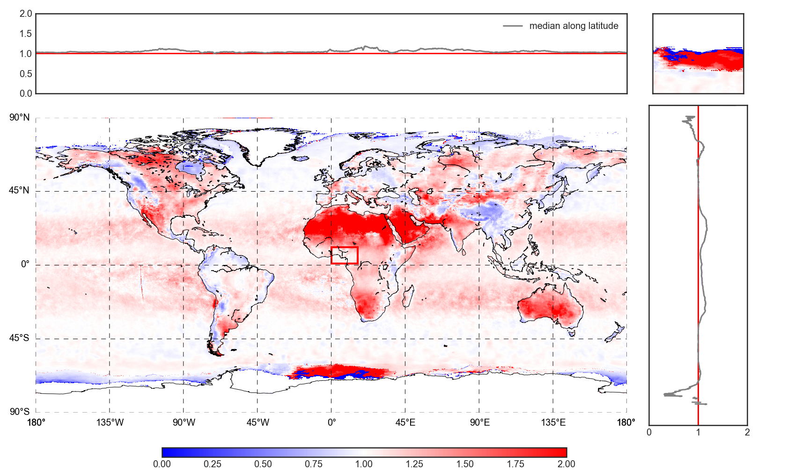
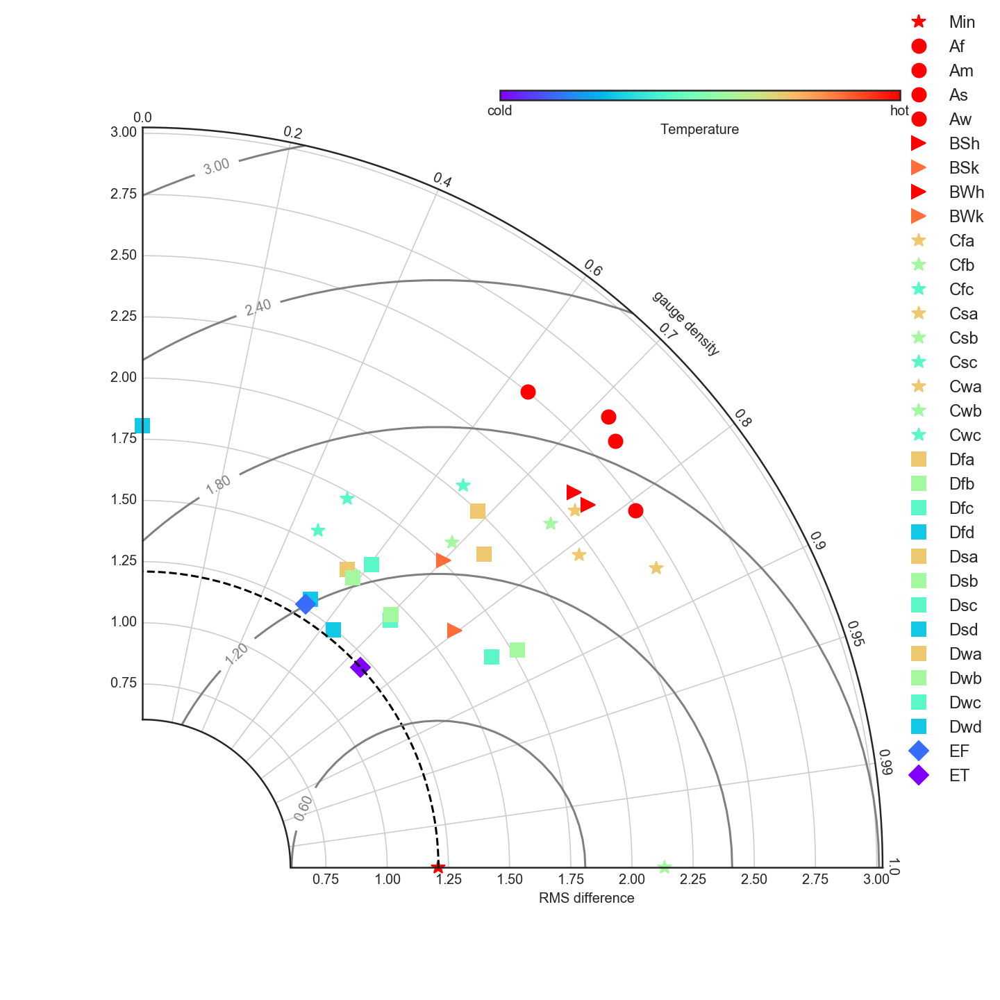

# geoPackage

This python package used for geo-data manipulation based on the backend of gdal.

## Getting Started

This package is mainly built on Python-3.7, may conflict with other versions.

### Prerequisites

By installing required python packages

```
pip install -r requirements.txt
```

**Descriptions on how to install gdal and gdal python wrapper**
```
wget https://download.osgeo.org/gdal/2.1.0/gdal-2.1.0.tar.gz
cd gdal-2.1.0/
./configure --prefix=/usr/
make
sudo make install
cd swig/python/
sudo python setup.py install
```

### Installing

A step by step series of examples that tell you how to get a development env running

Say what the step will be

```
git clone https://github.com/chrimerss/geoPackage
python setup.py install
```


## Features


### IO

This module deals with file IO, including raster file (.tif), vector file (.shp), h5file (.f5) mainly for NASA IMERG precipitation data.

```
from geoPackage.io import ReadFile

raster= ReadFile(raster_pth).raster

vector= ReadFile(vector_pth).vector

h5= ReadFile(h5_pth).layer
```

### Raster point sampling

extract point values by providing POINT vector

```
raster= ReadFile(raster_pth).raster

pnts= ReadFile(vector_pth).vector

values= raster.pointExtract(pnts)
```

### Raster crop by mask

```
raster= ReadFile(raster_pth).raster

polygons= ReadFile(vector_pth).vector

new_raster= raster.rasterClipByMask(polygons)
```

### visualization

visualization is based on matplotlib Basemap object

Taylor Diagram credit to: Yannick Copin 

```
from geopackage.visualize import layout, taylorPlot

raster= ReadFile(raster_pth).raster

layout(raster)
```
EXAMPLE:





## Built With

* [gdal](https://gdal.org/index.html) - The backend raster manipulation built
* [matplotlib](https://matplotlib.org/) - visualization built
* [geopandas](http://geopandas.org/) - vector built

## Contributing

Please contact author allen(chrimerss@gmail.com) if you want to contribute on this package.

## Versioning

Current version: 0.1

Coming with major changes.

## Authors

* **Allen Zhi Li** - *Initial work* - [Personal profile](https://chrimerss.github.io/homepage/)


## License

This project is licensed under the MIT License - see the [LICENSE.md](LICENSE.md) file for details


